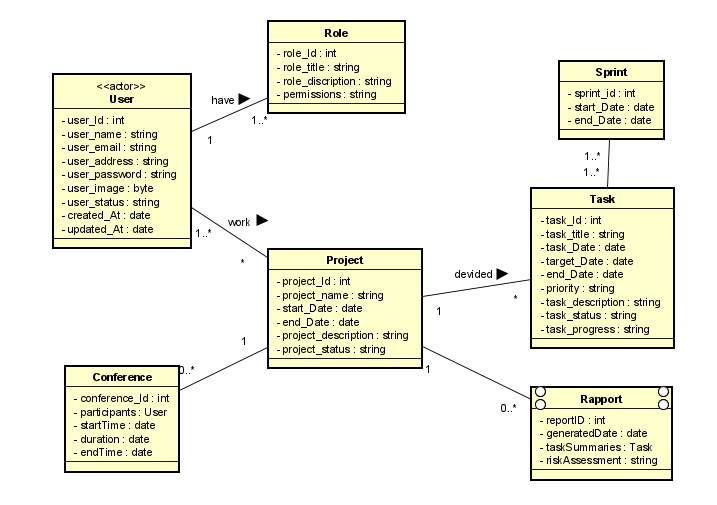
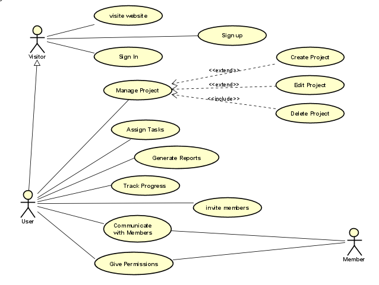
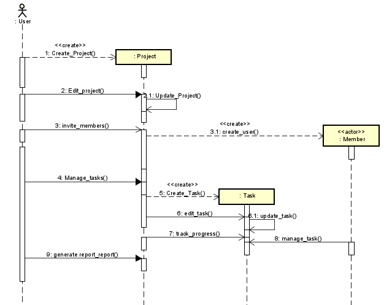
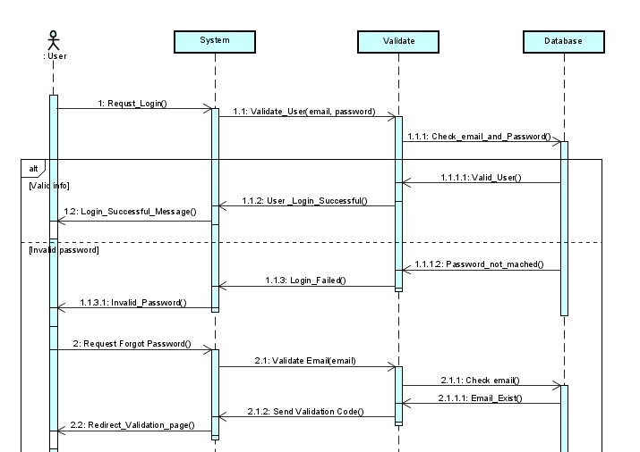
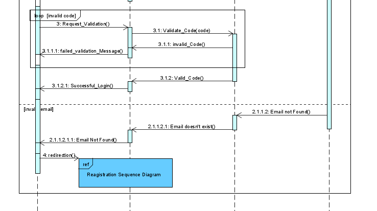
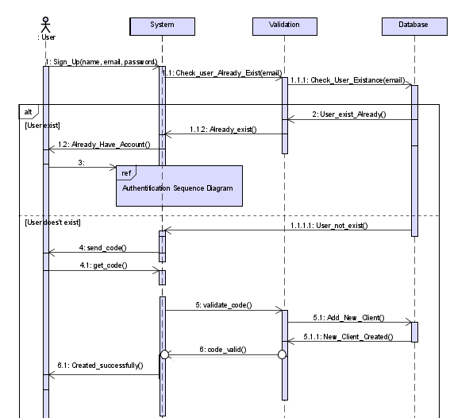

# Project Management System

A comprehensive project management system that integrates task management, real-time chat, video/audio conferencing, a chatbot, and automated report generation. This system aims to streamline project workflows and improve team collaboration, offering features similar to Jira, but enhanced with AI-driven automation and communication tools.

---

## Table of Contents
- [Overview](#overview)
- [Features](#features)
- [Diagrams](#diagrams)
    - [Class Diagram](#class-diagram)
    - [Use Case Diagram](#use-case-diagram)
    - [Sequence Diagrams](#sequence-diagrams)
- [Jira Project Board](#jira-project-board)
- [Installation](#installation)
- [Usage](#usage)

---

## Overview

This project management system is designed to help teams plan, execute, and collaborate on tasks in real-time, integrating several advanced features such as:
- **Task and Project Management**: Inspired by Jira, users can create tasks, assign them, and manage sprints.
- **Real-Time Communication**: Built-in chat and video conferencing to keep teams connected.
- **AI Chatbot**: To assist in task management and user queries.
- **Automated Reporting**: Automatically generated reports based on project progress.

---

## Features

1. **Task Management**: Create, assign, and track tasks.
2. **Real-Time Collaboration**:
   - **Chat Rooms**: Group and direct messaging.
   - **Conferencing**: Built-in video and voice conferencing with the ability to schedule meetings.
3. **AI-Powered Chatbot**:
   - Query the system for task updates, project statuses, etc.
   - Automate reminders and simple tasks.
4. **Automated Reports**: Generate project summaries, progress reports, and risk assessments.
5. **User Roles**: Manage access with different user roles (e.g., Admin, Manager, Developer).
6. **Agile Support**: Manage sprints and backlogs for agile teams.

---

## Diagrams

Below are the core diagrams that describe the structure and behavior of the system.

### Class Diagram

### Use Case Diagram

### Sequence Diagrams
1. **Task Creation Sequence**
   
   
   
2. **Authentification Sequence**
   
   
   

3. **Registration Sequence**
   
   

---

## Jira Project Board

We are using Jira to manage the project's tasks and progress. You can track the latest updates and sprint plans via the following link:

[Jira Project Board](https://0agram-nassima0.atlassian.net/browse/PMA)

---

## Figma Design

We are using figma to have the necessary mockup

[Figma design](https://www.figma.com/design/nn0mG7qMiT74sVCz6tZF32/Project-Management-App?node-id=5-14&node-type=canvas&t=0TkWAtSM9e2VUz9R-0)

---

## Installation

### Prerequisites
- Node.js
- MongoDB
- Docker 

## Usage

- After installation, users can:
  1. Create projects and assign tasks to team members.
  2. Use the built-in chat for collaboration and real-time messaging.
  3. Set up video and voice conferences directly within the app.
  4. Generate automated reports from project progress and task completion.

For a detailed walkthrough, see the [User Guide](your-user-guide-link-here).

---

